<h1 align="center">PP1 - Jamie's Portfolio</h1>

[View the live project here.](https://jamie-gargrave.github.io/portfolio-pp1/)

This is my portfolio to showcase to potential employers, clients, and to keep track of my work that I have completed throughout the course and any future/ extra website development opportunities I have taken part in. 

<h2 align="center">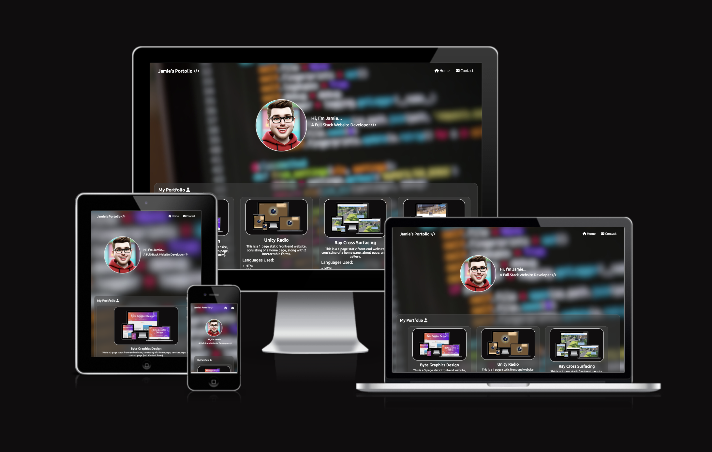</h2>

## User Experience (UX)

-   ### User stories

    -   #### Employer Visitor Goals

        1. As an Employer Visitor, I want to be able to view previous projects.
        2. As an Employer Visitor, I want to be able to get in contact with the developer easily.
        3. As an Employer Visitor, I want to be able to see responsive design with their website. 

    -   #### Client Visitor Goals

        1. As a Client Visitor, I want to be able to see current and previous projects. 
        2. As a Client Visitor, I want to be able to get in touch with the developer easily.
        3. As a Client Visitor, I want to be able to view the website and encounter no issue(s).

    -   #### Frequent Visitor Goals
        1. As a Frequent User, I want to be able to view if there have been any new projects that have been worked on/ updates/ created.
        2. As a Frequent User, I want the website to remain responsive once it has been updated with new projects.

-   ### Design
    -   #### Colour Scheme
        -   The three main colours used are Grey, Black & White.
    -   #### Typography
        -   The Ubuntu font is the main font used throughout the whole website with Sans Serif as the fallback font in case for any reason the font isn't being imported into the site correctly. 
    -   #### Imagery
        -   Imagery is important. The large hero image has been chosen to attract the viewers attention as well as the illustration of myself.

*   ### Wireframes

- ### Desktop/ PC Wireframes:

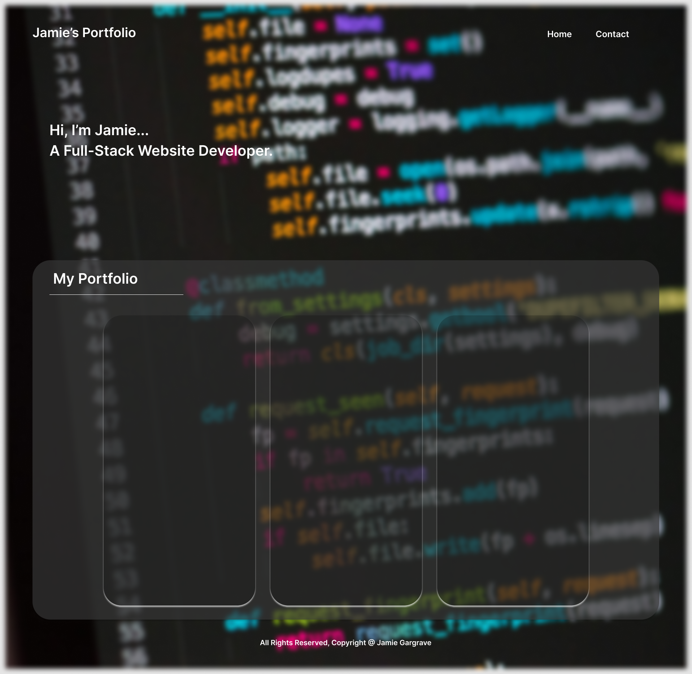
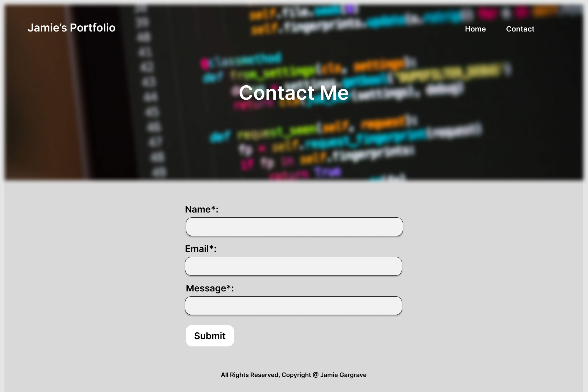

 - ### Tablet/ Mobile Wireframes:

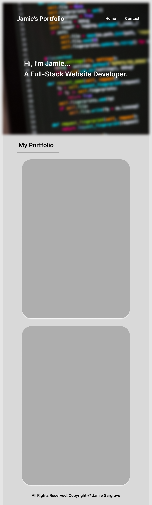
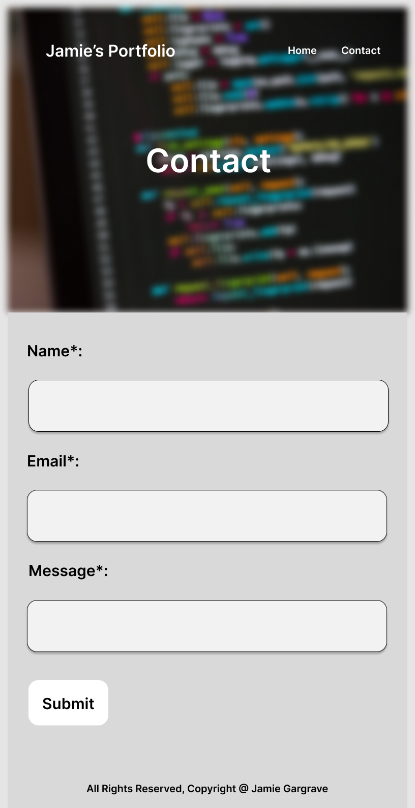

## Features

-   Responsive on all device sizes 

-   When a smaller screen is detected, the text for the navigation menu will change to icons. 

-   Header navigation will change to indicate the current page you're on (the text would underline/ change colour slightly).
  
-   Added a slight subtle effect to "Full-Stack" on the index page.

-   Created favicon images via the generate for the site to have an image in the tab view.

## Technologies Used

### Languages Used

-   [HTML5](https://en.wikipedia.org/wiki/HTML5)
-   [CSS3](https://en.wikipedia.org/wiki/Cascading_Style_Sheets)

### Frameworks, Libraries & Programs Used

1. [Google Fonts:](https://fonts.google.com/)
    - Google fonts were used to import the 'font names' font into the style.css file which is used on all pages throughout the project.
2. [Font Awesome:](https://fontawesome.com/)
    - Font Awesome was used on all pages throughout the website to add icons for aesthetic and UX purposes.
3. [Git](https://git-scm.com/)
    - Git was used for version control by utilizing the Gitpod terminal to commit to Git and Push to GitHub.
4. [GitHub:](https://github.com/)
    - GitHub is used to store the projects code after being pushed from Git.
5. [Figma:](https://www.figma.com/)
    - Figma has been used to complete my wireframes for Desktops /Tablets /Phones. 
6. Apple Playground (IOS Beta Feature)
    -  Playground was used to create an illustration of myself from a previous photo I took. 
7. [Favicon](https://favicon.io/favicon-converter/)
    -  Used to create the icon image on the website.
8. [Canva](https://www.canva.com/) 
    -  Used to create the icon to use with favicon. 
9. [I Am Responsive](https://ui.dev/amiresponsive)
    -  This was used to create the image at the top of the README.md file.
10. [VS Code](https://code.visualstudio.com/)
    -  Used to code the website.

## Testing

The W3C Markup Validator and W3C CSS Validator Services were used to validate every page of the project to ensure there were no syntax errors in the project.

### [W3C HTML Validator](https://validator.w3.org/#validate_by_input) 

#### Home Page Validation:
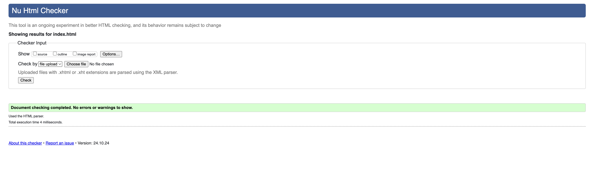 

#### Contact Page Validation:
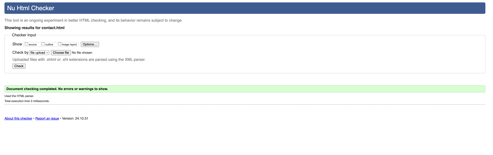

#### Form Submission Page Validation:
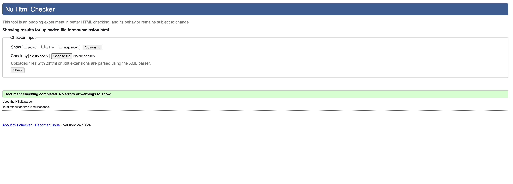


### [W3C CSS Validator](https://jigsaw.w3.org/css-validator/#validate_by_input) 

#### Home Page Validation:
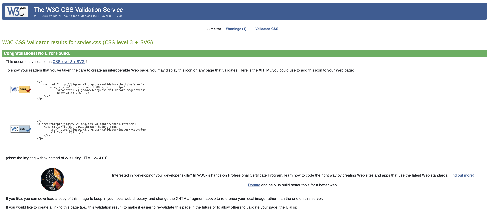 

### Testing User Stories from User Experience (UX) Section


-   #### Employer Visitor Goals

    1. As an Employer Visitor, I want to be able to view previous projects. 
       -   When employers view the site, they'll be able to clearly see previous projects that have been worked on via the hompage.
    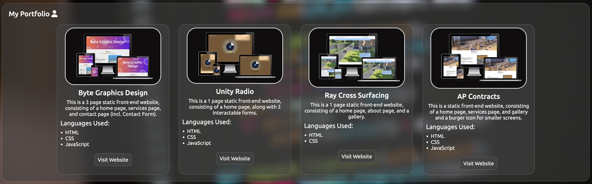
    2. As an Employer Visitor, I want to be able to get in contact with the developer easily.
       -   When employers view the site, they'll be able to see the navigation links in the header and can then access the contact page, fill in the details and get in touch.
    
    3. As an Employer Visitor, I want to be able to see responsive design with their website. 
       -   When employers view the site, they'll be able to see all information clearly, the website would adjust it's design depending on the screen size to ensure it is responsive. 
    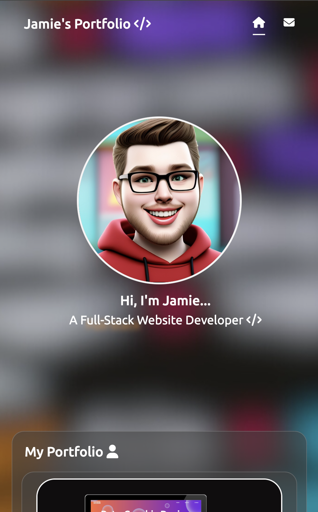

-   #### Client Visitor Goals
    1. As a Client Visitor, I want to be able to see current and previous projects. 
       -   When clients view the site, they'll be able to clearly see previous projects that have been worked on via the hompage.
    
    2. As a Client Visitor, I want to be able to get in touch with the developer easily. 
        -  When clients view the site, they'll be able to see the navigation links in the header and can then access the contact page, fill in the details and get in touch.
    
    3. As a Client Visitor, I want to be able to view the website and encounter no issue(s). 
       -   When clients view the site, they'll be able to see all information clearly, the website would adjust it's design depending on the screen size to ensure no issues are encountered. 
    

-   #### Frequent Visitor Goals
    1. As a Frequent User, I want to be able to view if there have been any new projects that have been worked on/ updates/ created.
        -  Upon visiting the page, users would be able to clearly see any new projects that have been added.
    
    2. As a Frequent User, I want the website to remain responsive once it has been updated with new projects.
        -  Upon visiting the page, they'll be able to see all information clearly, the website would adjust it's design depending on the screen size to ensure no issues are encountered. 
    

### Further Testing

-   The Website was tested on Google Chrome, Internet Explorer, Microsoft Edge and Safari browsers.
-   The website was viewed on a variety of devices such as Desktop, Laptop, iPhone15, iPhone 16 & iPad Pro.
-   Testing was performed to make sure that all links were working correctly as they should.
-   Peers, Friends, & Family were asked for their opinions on the site and were asked to assess of any bug/ issues that were in need of being fixes. 

### Known Bugs

- I encountered an issue after deploying my page that can be found [here](https://github.com/Jamie-Gargrave/portfolio-pp1/issues/1). This was due to an issue with the file paths which has since been corrected by updating them accordingly.
- I encountered validation issues that can be found [here](https://github.com/Jamie-Gargrave/portfolio-pp1/issues/2). I fixed this by applying the changes suggested, and changing the button ID to a class.
- I encountered a validation error on my contact page that can be found [here](https://github.com/Jamie-Gargrave/portfolio-pp1/issues/3), I fixed the suggested changes with what was proposed/ applied a suitable solution. 

## Deployment

### GitHub Pages

The project was deployed to GitHub Pages using the following steps...

1. Log in to GitHub and locate the [GitHub Repository](https://github.com/Jamie-Gargrave/portfolio-pp1)
2. At the top of the Repository (not top of page), locate the "Settings" Button on the menu.
3. Scroll down the Settings page until you locate the "GitHub Pages" Section.
4. Under "Source", click the dropdown called "None" and select "Master Branch".
5. The page will automatically refresh.
6. Scroll back down through the page to locate the now published site [link](https://jamie-gargrave.github.io/portfolio-pp1/) in the "GitHub Pages" section.

### Forking the GitHub Repository

By forking the GitHub Repository we make a copy of the original repository on our GitHub account to view and/or make changes without affecting the original repository by using the following steps...

1. Log in to GitHub and locate the [GitHub Repository](https://github.com/Jamie-Gargrave/portfolio-pp1)
2. At the top of the Repository (not top of page) just above the "Settings" Button on the menu, locate the "Fork" Button.
3. You should now have a copy of the original repository in your GitHub account.

### Making a Local Clone

1. Log in to GitHub and locate the [GitHub Repository](https://github.com/Jamie-Gargrave/portfolio-pp1)
2. Under the repository name, click "Clone or download".
3. To clone the repository using HTTPS, under "Clone with HTTPS", copy the link.
4. Open Git Bash
5. Change the current working directory to the location where you want the cloned directory to be made.
6. Type `git clone`, and then paste the URL you copied in Step 3.

```
$ git clone https://github.com/Jamie-Gargrave/portfolio-pp1
```

7. Press Enter. Your local clone will be created.

```
$ git clone https://github.com/Jamie-Gargrave/portfolio-pp1
> Cloning into `CI-Clone`...
> remote: Counting objects: 10, done.
> remote: Compressing objects: 100% (8/8), done.
> remove: Total 10 (delta 1), reused 10 (delta 1)
> Unpacking objects: 100% (10/10), done.
```

Click [Here](https://help.github.com/en/github/creating-cloning-and-archiving-repositories/cloning-a-repository#cloning-a-repository-to-github-desktop) to retrieve pictures for some of the buttons and more detailed explanations of the above process.

## Credits

### Code
  
-  All code has been written by the developer.

### Content

-   All content was written by the developer. 

### Media

-   All Images were created by the developer, with the exception of the hero image which can be found [here (Google Images)](https://www.google.com/search?sca_esv=fa65bd0a363ad061&sxsrf=ADLYWIKx5E2MbwNDMOCfZ7bJHHBOAIXc5A:1730989617595&q=coding&udm=2&fbs=AEQNm0Aa4sjWe7Rqy32pFwRj0UkWd8nbOJfsBGGB5IQQO6L3J_86uWOeqwdnV0yaSF-x2jon2iao6KWCaVjfn7ahz_sf9q37Zv4dbJ4TW_6SnErfFZ77vWA-JewUZjVu3roP919JJ7LB0XgUlbeu3TIUlWj0Hp1JHzwq5YPaSgTTkAC-edWrnsX-_paLirvXRRRiouDZnf1O&sa=X&ved=2ahUKEwjLvJDqtsqJAxXKUUEAHeeOOz4QtKgLegQIIhAB&biw=1352&bih=979&dpr=2#vhid=8dD8iMWqqw5i_M&vssid=mosaic). The illustration was created using Apple Playground, which is a apart of the IOS beta. 


### Acknowledgements

-   Course Tutor support at EKC for their support.
-   My mentor for feedback on the project.